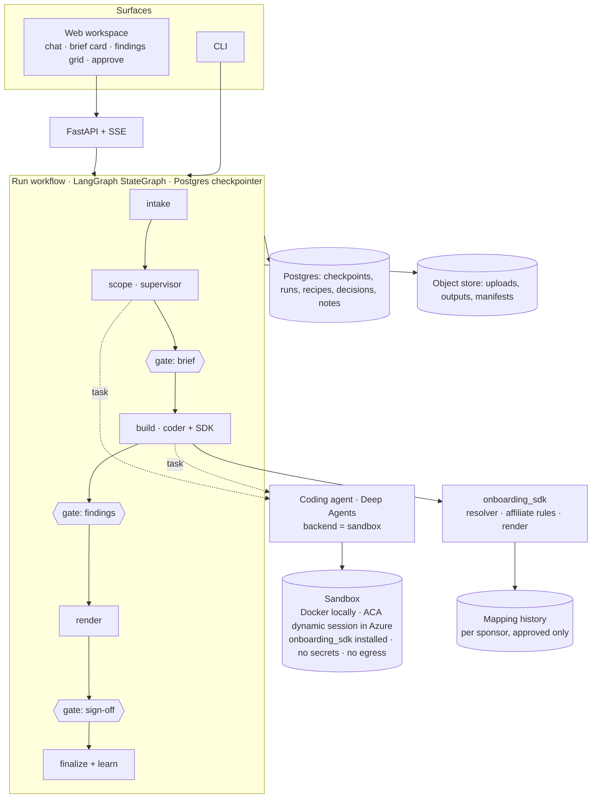
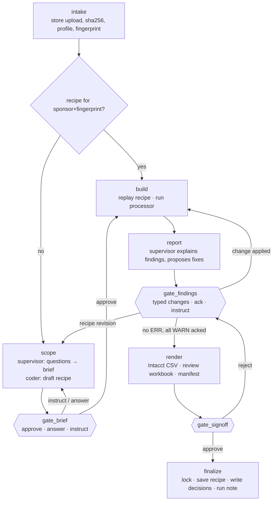

# Affiliate slice: implementation plan

Status: revision 3, ready for review before implementation · 25 Sep 2026
Scope: one static entity (Affiliate), end to end, with the full agentic architecture in miniature
Models: OpenAI only. `gpt-5.6-terra` locally; `gpt-5.6-sol` or `gpt-6-astra` on Azure. No Claude models, no Claude Agent SDK.
Harness: LangChain Deep Agents for every agent, including the coding agent.
Principle: column matching uses the existing `attribute_mapper` engine from `string_matcher_v1`, behind our own resolver interface. Resolution is history-first, ontology-second, agent-judged and human-confirmed. History starts empty, is built from analyst-confirmed decisions, and is **strictly per sponsor**.

---

## 1. What this slice must prove

Affiliate is the smallest flow (a handful of rows, five output columns, one path, four phases). That makes it the right place to prove the architecture, not the accounting. By the end of the slice the following must work on real messy files:

1. An analyst uploads an affiliate source in **any reasonable layout**: a clean CSV, an XLSX with title rows and notes sheets, different header names, or **no dedicated file at all**, where affiliates must be derived from a GL extract. The flow document explicitly allows this case.
2. A **supervisor agent** profiles the file, asks at most a few precise questions, and writes an **onboarding brief** for approval.
3. Every mapping decision is resolved **history first**, using the `attribute_mapper` cascade: the sponsor's own approved mappings, then ontology aliases (transcribed from the business mapping sheets), then fuzzy, embedding and LLM routes. The supervisor then judges anything still open using the file's values as evidence, and the analyst confirms. There is no history today, so the first run for a sponsor relies on the ontology and judgement. Every confirmed decision is written to **that sponsor's** history, and the next run starts from it.
4. A **coding agent**, also built with Deep Agents, writes a small **recipe** that turns the raw file into a canonical affiliate table. The resolved column bindings are written into the recipe with their provenance. It runs the recipe in a sandbox, verifies it, and hands it back.
5. Our own deterministic Affiliate rules module produces the Intacct template and the findings (ERR/WARN). It is ported from the existing processor and proven equal to it by differential tests.
6. The analyst resolves errors and acknowledges warnings in a conversation. Every instruction is restated, dry-run and checked before it takes effect.
7. On sign-off the run is locked. Outputs are the Intacct CSV, a review workbook with live formulas and a manifest. The recipe is saved and **replays without the model** on the next file with the same layout.
8. The same code runs locally (Docker sandbox, OpenAI API) and in Azure (Container Apps, dynamic sessions, Azure OpenAI with Entra ID).

Out of scope for this slice: other entities, running COA mapping (the resolution engine is built so COA plugs in as a second resolver kind), the monitor and improvement agents, and Intacct API publishing. The design leaves room for all of them.

---

## 2. What we take from existing work, and what we own

### 2.1 `string_matcher_v1`

`string_matcher_v1` covers one step of the workflow: matching source attributes to the Intacct template. **We use its matching engine (`attribute_mapper`) for column binding**, wrapped behind our own `Resolver` interface. That keeps the rest of the system independent of it, and lets COA, investor and investment resolvers plug in later with the same contract.

| Asset | Where | How it is used |
|---|---|---|
| `Matcher.map_entity(entity_type, source_columns, tenant_id=…)` → `MapRun`; `Matcher.resume(thread_id, review)` | `src/attribute_mapper/matcher.py` | **Runtime dependency.** Column-binding resolver. `tenant_id` is always the sponsor id |
| Cascade: history → alias → fuzzy (score 0.90, margin 0.08) → embedding → LLM (candidate-constrained) → review interrupt → record | `workflow/graph.py`, `matching/nodes/*` | Used as is. The LLM and embedding routes are configured for OpenAI or Azure OpenAI (`gpt-5.6-terra` locally) through `llm_base_url` / `embedding_base_url` |
| `PostgresHistoryStore` (`mapping_history`, `mapping_history_events`), approved-only, per `tenant_id` | `adapters/postgres_history.py` | **The per-sponsor history store.** Starts empty; written only when the analyst confirms |
| Ontologies (`affiliate.v1.json` and six others) with aliases transcribed from the business mapping sheets | `resources/ontology/` | The "already mapped by the business" knowledge used on a sponsor's first run |
| `ApprovedBindingSet.from_map_run` | `src/onboarding/bindings.py` | Hand-off from confirmed bindings to the recipe |
| Affiliate rules: ID derivation (uppercase, strip, 30 chars), dedup without auto-suffix, truncation collisions, name truncation, ITEM_TYPE override, ack gate | `src/onboarding/static/affiliate.py` | **Ported** into `onboarding_sdk.entities.affiliate`. A differential test requires identical CSV and findings. This keeps the dependency limited to matching |
| Finding codes | same | Kept identical: `AFF_ERR_ITEM_ID_BLANK`, `…_TOO_LONG`, `…_DUPLICATE`, `…_TRUNCATION_COLLISION`, `AFF_WARN_ITEM_ID_DERIVED`, `…_CHARS_STRIPPED`, `…_NAME_TRUNCATED`, `…_ZERO_RECORDS`, `…_ITEM_TYPE_OVERRIDE` |
| Test corpus and header variants | `tests/corpus`, `tests/variants` | Resolver evaluation cases |
| Fixtures + `expected.json` | `docs/sample_data/affiliate/` | Golden oracle (clean, edge, empty, source) |
| `account_mapping_history.csv`, `chart_of_accounts.csv`, `transaction_type_accounts.csv` | `docs/sample_data/reference/` | Reference formats for the future COA resolver |

**Known issues to settle before coding (SME decisions):**

- The ontology target is `ITEMTYPE`; the template column is `ITEM_TYPE`. Pick one; the Intacct template is authoritative.
- The default item type is `Inventory` in the flow PDF and `Non-Inventory` in the mapping sheet. The processor defaults to Inventory, with Non-Inventory as an acknowledged override.
- The derived-ID character-stripping rule (`'`, `&`) is "not specified in the sheet". It currently raises a warning that needs acknowledgement.
- There is no mapping history today. It is built from confirmed decisions, per sponsor. The real mapping workbooks are still useful for **verifying the ontology aliases**, which were transcribed from photos.

### 2.2 From `langchain-ai/paid-media-agent` (Deep Agents 0.7.x reference)

| Pattern | Their code | Adopt as |
|---|---|---|
| One shared assembly; runtimes compose it and never fork it | `assembly.py` | `assembly.py`: model, tools, middleware, interrupts built once for CLI, API and tests |
| Runtime profile (storage, providers, paths) | `runtime/profiles.py` | `RuntimeProfile(local \| azure)` |
| Tool surface decided in code, not prompts | `middleware/authorization.py` (`InvocationGuardMiddleware`, hides `task`, `execute`, `delete`) | Same guard. Supervisor: no `execute`. Coder: `execute` only inside the sandbox |
| Oversized tool results offloaded to artifacts | `middleware/offload.py` | Same |
| Secret redaction; model retry, timeout, call limit | `middleware/redaction.py`, `timeout.py`, `ModelCallLimitMiddleware` | Same |
| Filesystem permissions; runtime skills read-only | `runtime/local.py` (`FilesystemPermission`, `FilesystemBackend(virtual_mode=True)`) | Same |
| `instructions.md` short system prompt pointing to skills | `instructions.md`, `workspace/skills/*/SKILL.md` | `instructions/supervisor.md`, `instructions/coder.md`, `workspace/skills/…` |
| Scripted chat model for offline graph tests | `testing/scripted_model.py` | Same pattern for CI without API keys |
| Question eval with ground truth and grader | `tests/eval/` | `tests/eval/affiliate_cases.json` + grader |
| Self-hosted runtime with `AsyncPostgresSaver` | `runtime/self_hosted.py` | Same, on Azure Postgres |
| Typed proposal → approval → execute with digest | `tools/writes.py` | Pattern for "instruction → restated change → approve" |
| `AGENTS.md` for coding agents working on the repo | root | Same, so Codex or similar can help build it |

**What differs from paid-media.** The open-source paid-media agent never gives the model a shell (`execute` is hidden) and uses no subagents. We need both, in a controlled way. The **coding agent** gets `execute`, but only against an isolated sandbox with no secrets and no network. The **supervisor** gets `task` to delegate to that one subagent. It never gets `execute`.

---

## 3. Target architecture for the slice



**Three layers, strictly separated:**

1. **Spine**: a plain LangGraph `StateGraph` for one run. It owns phases, gates (`interrupt()`), locks and persistence. Nothing agentic decides whether a gate passes.
2. **Agents**: two Deep Agents. The **supervisor** handles conversation, profiling, questions, the brief, explanations and restating instructions. The **coding agent** writes, runs and verifies recipes in the sandbox. The spine calls the agents from inside its nodes.
3. **Deterministic core**: the `onboarding_sdk` package, installed in the sandbox image and importable on the host. It contains the readers, profiler, the **history-first resolution engine**, recipe contract checks, the Affiliate rules module, renderers and the review workbook.

### 3.1 Why a spine plus agents, not one big agent

- The documented flow has fixed gates ("resolves all ERR · acknowledges WARN — gate before Phase 4"). They must hold even if a model misbehaves.
- Gate state must survive days and restarts. LangGraph interrupts with the Postgres checkpointer give that, and so does Open Deep Research's clarify-then-supervise structure.
- Agents stay small and testable. Each node invokes an agent with a bounded task and a structured result.

---

## 4. The recipe contract (the heart of the design)

A recipe turns the **raw upload into the canonical affiliate table**. That is the only part that varies by customer. It never applies business rules; the SDK does.

```python
# /work/recipe.py — written by the coding agent, reviewed via the brief, frozen on approval
from onboarding_sdk import read
from onboarding_sdk.canonical import AffiliateCanonical, Row

RECIPE = {
    "entity": "affiliate",
    "sdk": ">=0.1,<0.2",
    "summary": "Sheet 'Affiliates', header on row 4; stop at first blank row; ignore 'Notes' sheet",
    # Resolved before the recipe is written; provenance is kept for audit and for history write-back
    "bindings": {
        "affiliate_id": {"column": "Affil. Code", "route": "history", "history_decisions": 3},
        "affiliate_name": {
            "column": "Legal Entity Name",
            "route": "agent",
            "confidence": "high",
            "evidence": "values are legal entity names; ontology alias 'entity name'",
        },
    },
}


def prepare(src: read.Workbook) -> AffiliateCanonical:
    sheet = src.sheet("Affiliates")
    table = sheet.table(header_row=4, stop_at_blank=True)
    rows = [
        Row(
            affiliate_id=r.get(RECIPE["bindings"]["affiliate_id"]["column"]),
            affiliate_name=r.get(RECIPE["bindings"]["affiliate_name"]["column"]),
            source_sheet=sheet.name,
            source_row=r.row_number,
        )
        for r in table.rows()
        if (r.get("Legal Entity Name") or r.get("Affil. Code"))
    ]
    return AffiliateCanonical(rows=rows)
```

**Canonical schema** (`AffiliateCanonical`):

| Field | Type | Rule |
|---|---|---|
| `affiliate_id` | `str \| None` | As supplied; blank → None. Never derived here; derivation is the processor's job |
| `affiliate_name` | `str \| None` | As supplied, whitespace-trimmed |
| `source_sheet`, `source_row` | `str`, `int` | Mandatory lineage back to the upload |

**Contract checks** (`onboarding_sdk.recipes.check(recipe_path, upload_path)`):

1. The module imports only allow-listed packages (`onboarding_sdk`, stdlib, `polars`, `pandas`, `openpyxl`, `re`, `datetime`), checked by AST scan.
2. `prepare` returns `AffiliateCanonical`, and every row has lineage.
3. Running twice gives an identical content hash (determinism).
4. There is no network and no filesystem write outside `/work/out` (enforced by the sandbox and also checked).
5. Coverage report: source rows read, rows emitted, rows dropped with reasons. Drops must be explained in the brief.
6. Every canonical field has a binding with a route. Routes other than `history` must be confirmed at the brief gate before the recipe is frozen.

The Affiliate rules module (`onboarding_sdk.entities.affiliate`) then runs on the canonical table. Bindings are data inside the recipe, not hidden inside the code. The brief shows them, history records them, and a changed binding means a new recipe version.

**Fingerprint and replay.** `profile.fingerprint(workbook)` = sha256 over sheet names, detected header row, normalised header set and column type signature. A recipe is stored against `(sponsor, entity, fingerprint)`. On the next upload with the same fingerprint, the spine replays the recipe in the sandbox with **no model call**. Supervisor and coder are skipped unless the replay fails its contract checks or produces new findings.

---

## 5. The resolution engine: history first, per sponsor

The business team maps by precedent: "what did we map this to last time for this sponsor?" The engine makes that the first route, always. It sits behind one interface, so each matching problem gets its own implementation, key, constraints and thresholds:

```python
class Resolver(Protocol):
    kind: str

    def resolve(self, sponsor_id: str, keys: Sequence[Key], evidence: Evidence) -> ResolutionSet: ...
    def confirm(self, sponsor_id: str, run_id: str, decisions: Sequence[Decision], reviewer: str) -> None: ...
```

| Resolver kind | Implementation | Key | Target | Slice |
|---|---|---|---|---|
| `column_binding` | **`attribute_mapper.Matcher`** (adapter) | source header | ontology concept → canonical field | **Affiliate (this slice)** |
| `account_mapping` | new, same cascade pattern | `normalize(Account Type) \| normalize(GL Account) \| normalize(Trans Type)` | `ACCT_NO` + `GLENTRY_CLASSID`, constrained to the TT valid set | GL slice |
| `investor_identity` | new | Common ID → Specific ID → normalised name | `CUSTOMER_ID` | Investor/LP slices |
| `investment_lookup` | new | Deal Name + Position | `DEPT_ID` | GL slices |

### 5.1 Column binding cascade (from `attribute_mapper`)

1. **History for this sponsor.** An exact hit on the normalised header among decisions approved for this sponsor. Accept.
2. **Ontology alias.** An exact alias hit; aliases come from the business mapping sheets. Accept unless ambiguous.
3. **Fuzzy.** Token Dice plus Levenshtein. Accept at score ≥ 0.90 with a margin ≥ 0.08; otherwise keep a shortlist.
4. **Embedding.** Cosine similarity with the same gates (OpenAI or Azure OpenAI embeddings).
5. **LLM route.** Picks from the shortlist or abstains (structured output, `gpt-5.6-terra`).
6. **Supervisor judgement (added by us).** For anything still `needs_review`, the supervisor looks at **sample values** from the file (`attribute_mapper` is header-only). For example, values like `AFF_9001` mark an ID column even under the header "Code". It proposes a column with a rationale, or abstains.
7. **Analyst.** Confirms or overrides at the brief gate. Only then does the adapter resume the matcher thread (`Matcher.resume`) and the approval is recorded in history.

### 5.2 Building history, per sponsor

- **Cold start.** No history exists. A sponsor's first run relies on ontology aliases, the similarity and LLM routes, supervisor judgement and analyst confirmation. The brief marks every binding that did not come from history, so the analyst knows what to check.
- **Write-back.** Confirmed bindings are written with `record_approval(…, reviewer, event_id=f"{run_id}:{concept}")`. That call is idempotent and writes to `mapping_history_events` (append-only) and `mapping_history` (effective counts). Overrides are also recorded, so a wrong suggestion is not repeated.
- **Strictly per sponsor.** The adapter always passes `tenant_id = sponsor_id` and **refuses** `tenant_id="*"`. That matters because `attribute_mapper`'s history lookup falls back to `'*'` rows when they exist. Never writing `'*'` rows keeps one sponsor's mappings from appearing for another. A test asserts no cross-sponsor hits.
- **Other decisions** (ID overrides, excluded rows, item type, acknowledgements) are stored per run in `run_decisions`. They are not matching history. Recurring ones can become sponsor knowledge through the approval path.
- **Where it runs.** Resolution is a host-side tool (it needs the database). The sandbox receives only the **confirmed bindings** (`/ref/bindings.json`) and the ontology (read-only). The coding agent never holds database credentials.

### 5.3 Where the coding agent fits

The coding agent does not re-implement matching per run. That would be non-deterministic and would bypass history. Its matching work is:

- **Profiling values** in the sandbox to give the supervisor better evidence (types, patterns, cardinality, which sheet looks like the list).
- **Writing the confirmed bindings into the recipe** with their provenance, so replay reuses them with no model call.
- **Proposing ontology changes** as reviewable diffs, such as new aliases seen across runs. These go through SME approval, never straight into history.

For COA the same split applies. The cascade runs deterministically over distinct keys and the per-sponsor account-mapping history comes first. The agent adjudicates what is left inside the valid-account set, and the analyst confirms. Per-sponsor scope also applies to the flow's "golden" account store; whether a cross-sponsor golden store is allowed is a separate decision for the GL slice.

---

## 6. Agents

### 6.1 Model configuration (OpenAI only)

```dotenv
# local
ONB_MODEL_PROVIDER=openai
OPENAI_API_KEY=...
ONB_SUPERVISOR_MODEL=gpt-5.6-terra
ONB_CODER_MODEL=gpt-5.6-terra
ONB_SUPERVISOR_EFFORT=medium
ONB_CODER_EFFORT=high

# azure dev
ONB_MODEL_PROVIDER=azure_openai_v1
AZURE_OPENAI_BASE_URL=https://<resource>.openai.azure.com/openai/v1/
ONB_SUPERVISOR_MODEL=gpt-6-astra        # deployment name
ONB_CODER_MODEL=gpt-5.6-sol             # deployment name
# auth: Entra ID via managed identity, no key
```

```python
# src/onboarding_agent/models.py
from langchain_openai import ChatOpenAI


def chat_model(role: Role, s: Settings) -> ChatOpenAI:
    kw = dict(
        model=s.model_for(role),
        use_responses_api=True,
        reasoning={"effort": s.effort_for(role)},
        timeout=s.model_timeout,
        max_retries=2,
    )
    if s.model_provider == "azure_openai_v1":
        from azure.identity import DefaultAzureCredential, get_bearer_token_provider

        kw |= dict(
            base_url=s.azure_openai_base_url,
            api_key=get_bearer_token_provider(DefaultAzureCredential(), "https://cognitiveservices.azure.com/.default"),
        )
    return ChatOpenAI(**kw)
```

- Azure OpenAI's v1 API is used through `ChatOpenAI` with `base_url` and an Entra token provider. `AzureChatOpenAI` is only needed for dated `api-version` endpoints.
- Deep Agents enables the Responses API for `openai:*` strings. Because we pass a model instance, we set `use_responses_api=True` ourselves.
- GPT-5.6 Terra: 1.05M context, 128k output, reasoning effort none → max, tools and structured outputs supported. GPT-6 Astra, Sol and Luna are GA in Microsoft Foundry, including **EU Data Zone** deployments, which matters for UK/EU data residency.
- A later option is `gpt-6-luna` for cheap bulk sub-tasks. It isn't needed for Affiliate.

### 6.2 Supervisor (Deep Agent)

```python
supervisor = create_deep_agent(
    chat_model("supervisor", s),
    tools=[
        profile_upload,
        recall_recipe,
        resolve_columns,
        run_pipeline,
        get_findings,
        dry_run_change,
        submit_brief,
        submit_report,
        save_run_note,
    ],
    system_prompt=load("instructions/supervisor.md"),
    subagents=[
        CompiledSubAgent(
            name="recipe-engineer",
            description="Writes, runs and verifies an onboarding recipe in the sandbox",
            runnable=coder_graph,
        )
    ],
    skills=["/skills/"],
    memory=[f"/sponsors/{sponsor}/AGENTS.md"],  # run notes (hints only)
    backend=CompositeBackend(
        default=FilesystemBackend(root_dir=run_dir, virtual_mode=True),
        routes={"/skills/": skills_backend, "/sponsors/": notes_backend},
    ),
    permissions=supervisor_permissions(),  # skills read-only; writes only /run/notes
    middleware=[
        guard(allowed=SUPERVISOR_TOOLS, hidden={"execute", "delete"}),
        offload,
        redaction,
        ModelCallLimitMiddleware(run_limit=40),
        retry,
        timeout,
    ],
    name="supervisor",
)
```

| Tool | Deterministic? | Returns |
|---|---|---|
| `profile_upload(file_id)` | yes | Sheets, header-row candidates with scores, columns, type and fill stats, 5 sample rows per sheet, fingerprint |
| `recall_recipe(sponsor, fingerprint)` | yes | Recipe id and summary, or none |
| `resolve_columns(file_id, sheet, header_row)` | yes (`attribute_mapper`, sponsor-scoped) | Per canonical field: resolved column and route (history / alias / fuzzy / embedding / llm), or a shortlist plus sample values for the supervisor to judge |
| `similar_decisions(key)` | yes | This sponsor's past approved decisions for similar headers, with who decided and when |
| `run_pipeline(recipe_id, options)` | yes | Runs recipe + processor in the sandbox. Returns counts, findings summary, artifact ids; never raw rows |
| `get_findings(run_id, code?)` | yes | Findings with source rows and lineage |
| `dry_run_change(change)` | yes | Applies a typed change to a copy of options or recipe inputs. Returns a diff: rows changed, findings added or removed |
| `submit_brief(OnboardingBrief)` | structured | Stored in spine state; ends the scope node |
| `submit_report(RunReport)` | structured | Stored in spine state; shown at the gate |
| `save_run_note(text)` | writes | Appends to the sponsor's notes file (hint, not rule) |

**Typed changes** (`dry_run_change`) are the only way user instructions alter a run:

`SetColumnRole`, `SetHeaderRow`, `SetSheet`, `SetItemType(value)`, `OverrideItemId(source_row, value)`, `ExcludeRow(source_row, reason)` (sets `DONOTIMPORT='#'`), `AcknowledgeWarning(code, rows)`, `RequestRecipeRevision(instruction)`.

Each change is validated against policy. For example, `OverrideItemId` must be ≤30 characters, `[A-Z0-9_]` and unique, and `SetItemType` must be in the approved set. A change that would breach a rule is refused and the rule is named.

### 6.3 Coding agent: recipe engineer (Deep Agent with a sandbox backend)

```python
coder_graph = create_deep_agent(
    chat_model("coder", s),
    tools=[],  # works through the filesystem + execute
    system_prompt=load("instructions/coder.md"),
    skills=["/skills/"],  # recipe-authoring, affiliate
    backend=CompositeBackend(
        default=sandbox_backend,  # /work, /in (read-only upload)
        routes={"/skills/": skills_backend},
    ),
    permissions=coder_permissions(),  # write only /work/**
    middleware=[
        guard(allowed=FS_TOOLS | {"execute"}, hidden={"task", "delete"}),
        offload,
        redaction,
        ModelCallLimitMiddleware(run_limit=30),
        retry,
        timeout,
    ],
    name="recipe-engineer",
)
```

Its loop follows gather → act → verify:

1. Read `/skills/recipe-authoring/SKILL.md` and `/skills/affiliate/SKILL.md`.
2. Inspect `/in/<upload>` with the SDK (`python -m onboarding_sdk.inspect /in/file.xlsx`). It prints a profile, never the whole file.
3. Write `/work/recipe.py`.
4. Run `python -m onboarding_sdk.recipes check /work/recipe.py /in/file.xlsx`, which runs the contract checks and writes a coverage report.
5. Fix and repeat, up to N iterations.
6. Return a structured `RecipeResult`: path, summary, coverage, open questions.

It never sees secrets and never calls the processor's publish path. It can only produce a candidate recipe.

### 6.4 Skills (runtime, read-only)

```
workspace/skills/
  onboarding-method/SKILL.md      # phases, gates, how to write a brief, how to ask questions
  affiliate/SKILL.md              # flow rules, template, finding codes and what each means
  affiliate/references/flow.md    # transcribed from the Affiliate process flow (6 pages)
  affiliate/references/template.md# Intacct columns, lengths, constants, conflicts + SME rulings
  recipe-authoring/SKILL.md       # recipe contract, SDK API, allowed imports, check command
  recipe-authoring/examples/      # 3 worked recipes: clean CSV, titled XLSX, derive-from-GL
  fund-admin-wiki/                # glossary: sponsor, fund complex, affiliate, GP, Intacct basics
```

Rules live in code; skills explain principles and procedure ("skills over rules").

---

## 7. The run workflow (spine)

### 7.1 State

```python
class RunState(TypedDict):
    run_id: str
    sponsor: str
    entity: Literal["affiliate"]
    upload: UploadRef  # blob uri, sha256, filename
    profile: WorkbookProfile | None
    recipe: RecipeRef | None  # id, version, sha256, source ("recalled" | "authored")
    options: AffiliateOptions  # item_type, id_overrides, excluded_rows, acknowledged
    brief: OnboardingBrief | None
    result: PipelineSummary | None  # counts, findings, artifact ids
    report: RunReport | None
    decisions: Annotated[list[Decision], add]  # append-only: who, what, when, why
    status: Literal[
        "scoping",
        "awaiting_brief",
        "building",
        "awaiting_findings",
        "rendering",
        "awaiting_signoff",
        "locked",
        "failed",
    ]
```

### 7.2 Nodes and gates



- **Gates** are nodes that call `interrupt(payload)`. The UI resumes with a typed `GateResponse`: `approve`, `answer(question_id, value)`, `change(TypedChange)`, `instruct(text)` or `reject(reason)`.
- `instruct(text)` goes to the supervisor. It restates the text as one or more typed changes, dry-runs them, and returns to the same gate with a diff for confirmation. Free text never changes a run directly.
- **Gate conditions** are pure functions over state: `can_pass_findings(state)` means no ERR and every ack-required WARN acknowledged. The spine refuses `approve` otherwise.
- **Locking**: `finalize` writes the manifest (upload sha, recipe sha, SDK version, options, decisions, output sha) and marks the run immutable. A correction needs a new run.

### 7.3 Onboarding brief (structured output)

```python
class OnboardingBrief(BaseModel):
    source: SourceSummary  # file, sheet, header row, rows read/emitted/dropped (+reasons)
    column_roles: list[ColumnRole]  # column → affiliate_id | affiliate_name | ignored, with route
    # (history | alias | fuzzy | embedding | llm | agent) + evidence
    id_strategy: Literal["source_id", "derive_from_name", "mixed"]
    item_type: Literal["Inventory", "Non-Inventory"]
    expected_findings: list[FindingPreview]
    questions: list[Question]  # ≤3, each with options and evidence
    recipe: RecipeRef  # authored or recalled
    confidence: Literal["high", "medium", "low"]
```

---

## 8. `onboarding_sdk` (new package, deterministic)

```
packages/onboarding_sdk/onboarding_sdk/
  read.py        Workbook/Sheet/Table over CSV and XLSX (python-calamine for speed, openpyxl fallback);
                 header-row detection; stop-at-blank; merged-cell handling
  profile.py     WorkbookProfile, header candidates with scores, type/fill stats, samples, fingerprint()
  resolve/       Resolver protocol; ColumnBindingResolver = adapter over attribute_mapper.Matcher
                 (sponsor = tenant_id, refuses '*'); value-evidence helpers for supervisor judgement
  ontology/      loads attribute_mapper ontologies; maps concepts → canonical fields
  canonical.py   AffiliateCanonical, Row; to_processor_csv()
  recipes.py     load, AST allow-list, run, determinism hash, coverage, CLI `check`
  entities/affiliate/  policy.yaml (limits, constants, finding codes, severities, ack rules) + rules.py:
                 process(canonical, options) → AffiliateResult (ported rules; applies
                 id_overrides and excluded_rows as documented pre-steps; records them as decisions)
  changes.py     typed changes + policy validation + dry_run()
  render.py      Intacct CSV (pinned template), manifest.json
  review.py      review workbook: Source, Upload preview (live formulas), Findings, Decisions, Brief
  inspect.py     `python -m onboarding_sdk.inspect` for the coder
```

`onboarding_sdk` depends on the `string_matcher_v1` package (`configurable-attribute-mapper`) **for matching only**. It is a path dependency locally and a wheel in the image. The Affiliate rules are ported; the differential test imports the original `AffiliateProcessor` as a dev-only oracle. Upstream fixes needed: ITEMTYPE vs ITEM_TYPE naming, and making the model id and endpoint configurable for the GPT-5.6/6 models (the defaults are `gpt-5.4-mini`).

**Review workbook, Affiliate version.** On the Upload preview sheet, `NAME` is `=LEFT(Source!C5,100)`, and a derived `ITEM_ID` shows the derivation as a formula or a documented value with its rule id. Finding rows link to source rows. This matches the competitor's in-cell audit trail.

---

## 9. Sandbox

One image, two backends, and the same Deep Agents `BaseSandbox` interface.

```
sandbox/
  Dockerfile        python:3.12-slim · onboarding_sdk wheel · polars · pandas ·
                    openpyxl · python-calamine · duckdb · ripgrep · non-root user · no secrets
  executor/         tiny FastAPI inside the image: POST /exec {cmd, timeout} · PUT/GET /files/{path} ·
                    GET /health — used by the ACA backend (the Docker backend uses docker exec)
```

| Backend | Where | Implementation |
|---|---|---|
| `DockerSandbox(BaseSandbox)` | local dev, CI | One container per run (`--network none`, read-only root, tmpfs `/work`, cpu/mem limits). `execute` = `docker exec`; files through `put_archive`/`get_archive` |
| `AcaSessionSandbox(BaseSandbox)` | Azure | Custom-container session pool, `identifier = run_id`. Calls go to the pool management endpoint and are forwarded to the executor. Managed identity token (audience `https://dynamicsessions.io`). Egress disabled. Cooldown about 30 min |
| `LocalShellBackend` | never | Deep Agents' own warning: no isolation. Allowed only in a throwaway spike |

Deep Agents needs only `execute`, `upload_files`, `download_files` and `id`. Every filesystem tool is built on top of them. A sandbox probe test (modelled on paid-media's `probe_sandbox`) checks Python, SDK import, `/work` writable, `/in` read-only, **no key-like environment variables** and **no outbound network**.

---

## 10. Persistence

| Store | Local | Azure | Holds |
|---|---|---|---|
| LangGraph checkpoints | Postgres (docker-compose) | Azure Database for PostgreSQL Flexible | Spine and agent threads, gate interrupts |
| Domain tables | same | same | `runs`, `run_decisions` (append-only), `recipes` (sponsor, entity, fingerprint, version, sha, source, approved_by), `sponsor_notes`, plus `attribute_mapper`'s `mapping_history` / `mapping_history_events` (per sponsor, section 5.2) |
| Objects | `./.data/objects` | Blob (immutable container for locked runs) | Uploads, canonical parquet, outputs, review workbook, manifest, recipe source |

Own schema and migrations (Alembic or plain SQL). The earlier repository's schema is a reference only.

---

## 11. Surfaces

- **API** (FastAPI): `POST /runs` (upload), `GET /runs/{id}`, `GET /runs/{id}/events` (SSE stream of graph `messages` / `updates` / `custom` events), `POST /runs/{id}/gate` (a `GateResponse`), `GET /runs/{id}/artifacts/{name}`. Entra ID auth in Azure and a dev token locally.
- **Web workspace** (Next.js, extending the existing `web/` app): conversation panel, brief card with approve/answer controls, findings grid (row, code, reason, proposed fix, ack), live preview of the upload table, download buttons. Keep it thin; logic stays in the API.
- **CLI**: `onboard run affiliate <file> --sponsor S` for local development. It streams the conversation in the terminal and answers gates interactively. This mirrors paid-media's `ask`.

---

## 12. Observability and safety

- OpenTelemetry spans for spine nodes, agent model calls, tools and sandbox `execute` (command, exit code, duration; never file contents). Locally: console plus optional Langfuse in docker-compose. Azure: Application Insights. No LangSmith.
- Middleware stack as in paid-media: invocation guard, result offload, redaction, retry, timeout, model call limit.
- The sandbox has no credentials and no network. The upload is mounted read-only.
- Model output is untrusted. Recipes pass AST and contract checks. Typed changes pass policy validation. Gates are code.

---

## 13. Testing and evaluation

| Layer | What | Runs |
|---|---|---|
| SDK unit | readers, header detection, fingerprint, canonical, changes, render, review workbook | CI |
| Golden | `expected.json` for clean / edge / empty must match exactly through the new path (recipe → canonical → processor) | CI |
| Differential | ported Affiliate rules vs the original processor on all fixtures: identical CSV bytes and findings | CI (dev-only dependency) |
| Resolver | adapter contract; history before alias before similarity; write-back only on confirmation; **no cross-sponsor hits** (sponsor B never sees sponsor A's decisions); `'*'` tenant refused; cold start works with empty history; evaluation on the `attribute_mapper` corpus and variants | CI |
| Returning sponsor | second upload from the same sponsor with renamed headers resolves from history with no agent call | CI + live eval |
| Recipe contract | AST allow-list, determinism, lineage, coverage on handwritten recipes | CI |
| Sandbox probe | isolation checks on the image | CI (Docker) |
| Graph contract | full spine with a **scripted model** (paid-media pattern): gates block, instruct → restate → confirm, replay skips model calls | CI, no keys |
| Live eval | 9 messy fixtures × `gpt-5.6-terra` | on demand, nightly |

**Messy fixtures to generate** (`tests/fixtures/affiliate/`, generator script, deterministic):

1. `clean.csv` (the existing fixture)
2. `titled.xlsx`: logo/title rows, header on row 4, a "Notes" sheet, trailing totals row
3. `renamed.xlsx`: headers `Affil. Code`, `Legal Entity Name`, `Entity Type`
4. `ids_missing.csv`: no ID column; all IDs derived
5. `edge.csv` (the existing fixture): every error and warning
6. `empty.csv`: header only
7. `from_gl.xlsx`: no affiliate list. A GL extract with a counterparty column, where affiliates are the distinct counterparties with type GP/Management/Related entity. This is the case from the flow document
8. `two_lists.xlsx`: two candidate sheets, which forces a question
9. `returning_sponsor.xlsx`: same sponsor as fixture 3 with the same unusual headers; must resolve from history written by fixture 3's approval, with no LLM or agent call. The same file under a **different** sponsor must not use that history

Every eval starts with **empty history** for the sponsor, matching today's reality.

**Live eval metrics per fixture:** passed without human edits (Y/N), questions asked, typed words needed, recipe iterations, model calls, tokens and cost, wall time, output equality with the expected CSV, and replay success on a second file with the same layout.

**Slice acceptance:** all CI layers green. The live eval passes 8 of 9 fixtures with at most 2 questions each. Replay makes zero model calls and produces a byte-identical CSV. The Azure dev deployment passes the same eval.

---

## 14. Repository layout (`recon_knowledge_work_agent_v2`)

```
AGENTS.md                         # rules for coding agents working on this repo
instructions/supervisor.md        # short system prompts
instructions/coder.md
workspace/skills/…                # runtime skills (read-only to agents)
workspace/sponsors/<sponsor>/AGENTS.md   # local run notes (Postgres-backed in Azure)
src/onboarding_agent/
  config.py  models.py  assembly.py
  agents/supervisor.py  agents/coder.py
  graph/state.py  graph/nodes.py  graph/gates.py  graph/build.py
  tools/…                         # profile, recall, bind, pipeline, findings, changes, brief, notes
  sandbox/docker_backend.py  sandbox/aca_backend.py
  recipes/store.py  recipes/fingerprint.py
  persistence/interfaces.py  memory.py  postgres.py
  middleware/guard.py  offload.py  redaction.py
  surfaces/api.py  surfaces/cli.py
  observability.py
packages/onboarding_sdk/…         # deterministic core (section 8)
sandbox/Dockerfile  sandbox/executor/
web/                              # workspace UI
tests/unit  tests/golden  tests/contract  tests/eval  tests/fixtures
infra/                            # Bicep: ACA env, apps, session pool, Postgres, Storage, KV, AOAI, App Insights
docker-compose.yml                # postgres, sandbox image build, api, web, optional langfuse
pyproject.toml  uv.lock
```

**Pinned stack:** Python 3.12 · `configurable-attribute-mapper` (from `string_matcher_v1`) · `deepagents>=0.7.19,<0.8` · `langchain>=1.4,<1.5` · `langgraph>=1.2.12,<1.3` · `langchain-openai>=1.6,<2` · `langgraph-checkpoint-postgres>=3,<4` · `psycopg[binary,pool]>=3.2` · `pydantic>=2.13` · `fastapi` · `azure-identity` · `python-calamine` · `openpyxl` · `polars` · `opentelemetry-sdk`. Deep Agents is beta, so pin exact versions in the lock file and upgrade deliberately.

---

## 15. Milestones

| # | Milestone | Deliverables | Done when |
|---|---|---|---|
| M0 | Foundations (2–3 d) | Repo scaffold, `AGENTS.md`, config, model factory, CI (ruff, mypy, pytest) | A `gpt-5.6-terra` tool-calling smoke test passes through Deep Agents with the Responses API; CI green |
| M1 | SDK and resolver (5–6 d) | read/profile/fingerprint, canonical, ported Affiliate rules, changes, render, review workbook, recipe contract CLI, fixture generator; column-binding resolver adapter over `attribute_mapper` with per-sponsor Postgres history | Golden and differential tests pass; resolver tests pass, including no cross-sponsor hits; returning-sponsor case resolves from history |
| M2 | Sandbox (3 d) | Image, executor, `DockerSandbox`, probe tests | Coder-style commands run in the container; probe passes (no secrets, no network) |
| M3 | Agents (5–6 d) | Supervisor, recipe engineer, skills, tools, guard, typed changes | Scripted-model contract tests pass; live run succeeds on fixtures 1–4 |
| M4 | Spine and persistence (4 d) | StateGraph, gates, Postgres checkpointer, recipes and decisions tables, manifest, replay | Restart mid-gate resumes; replay makes 0 model calls, byte-identical output |
| M5 | Surfaces (5 d) | API + SSE, web workspace, CLI | An analyst completes fixtures 1–8 end to end in the browser |
| M6 | Eval and hardening (3 d) | Live eval runner + grader, metrics, prompt and skill tuning | Slice acceptance criteria met locally |
| M7 | Azure dev (5 d) | Bicep, ACA apps, session pool + `AcaSessionSandbox`, Azure OpenAI (Entra), Postgres, Blob, App Insights | Same eval passes in Azure dev with `gpt-5.6-sol` / `gpt-6-astra` |

That is roughly six to seven weeks for one engineer, or four to five for two working in parallel (SDK and sandbox alongside agents and spine).

---

## 16. Decisions needed before M1

1. **SME rulings:** ITEMTYPE vs ITEM_TYPE; Inventory vs Non-Inventory default; the derived-ID character rule.
2. **Scope of the GL-derived case** (fixture 7). Recommended in scope: it is the clearest demonstration of the coding agent.
3. **UI:** extend the existing Next.js `web/` app (recommended), or start fresh.
4. **Sponsor identity for the slice:** a real anonymised sponsor for the live eval, or synthetic only.
5. **Azure data residency:** EU Data Zone deployments for the OpenAI models (available for GPT-6 family).
6. **Recipe storage:** Postgres rows plus source in Blob (recommended), or a Git repository per sponsor.
7. **Real files:** two or three anonymised real affiliate sources (or GL extracts) for the eval set.
8. **Ontology verification:** the real mapping workbooks, to verify aliases transcribed from photos (flagged low-confidence in the ontology notes).

Settled: history is per sponsor and starts empty; column matching uses `attribute_mapper`.

---

## 17. Risks specific to this slice

| Risk | Mitigation |
|---|---|
| Affiliate is too simple to show value | Include the titled, renamed, GL-derived and two-lists fixtures; measure questions and typed words |
| OpenAI model tool-use quirks inside Deep Agents | M0 smoke test; Deep Agents' OpenAI provider profile; keep tools few and typed; ModelCallLimit |
| Sandbox latency on ACA sessions | Ready-session pool; replay path skips the coder; keep recipes short |
| Deep Agents beta churn | Pin versions; thin adapter in `assembly.py`; contract tests catch API changes |
| Cold start with no history | Ontology aliases from the business sheets; value evidence for supervisor judgement; analyst confirmation; brief flags every non-history binding; measure precision of each route |
| History pollution or leakage | Only confirmed decisions are recorded; overrides recorded; tenant always the sponsor, `'*'` refused; cross-sponsor test |

## Sources

- paid-media-agent repository: https://github.com/langchain-ai/paid-media-agent
- Deep Agents: https://docs.langchain.com/oss/python/deepagents/overview · sandboxes: https://docs.langchain.com/oss/python/deepagents/sandboxes
- GPT-5.6 Terra model page: https://developers.openai.com/api/docs/models/gpt-5.6-terra
- GPT-6 Sol and Luna: https://openai.com/index/introducing-gpt-6-sol-and-luna/ · GPT-6 Astra: https://openai.com/index/gpt-6-astra/
- GPT-6 models in Microsoft Foundry: https://azure.microsoft.com/en-us/blog/gpt-6-astra-sol-and-luna-for-production-agents-in-microsoft-foundry/
- Azure OpenAI v1 with ChatOpenAI: https://docs.langchain.com/oss/python/integrations/chat/azure_chat_openai
- ACA custom container sessions: https://learn.microsoft.com/en-us/azure/container-apps/sessions-custom-container
