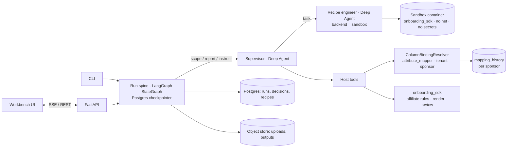

# MVP build plan: Affiliate onboarding workbench

Audience: the engineer (and Claude Code) implementing the MVP. Work top to bottom. Each task lists files, steps and an **acceptance check** that must pass before moving on.

Companion docs: `docs/reference/affiliate-flow.md` (business rules), `docs/ui-spec.md` + `docs/ui-mockup.html` (UI), `docs/affiliate-slice-implementation-plan.md` (the architecture rationale).

---

## 0. Decisions already made

| Topic | Decision |
|---|---|
| Entity | Affiliate only |
| Target column | `ITEM_TYPE` (default `Inventory`; `Non-Inventory` is an acknowledged override) |
| GL-derived affiliates | Out of scope |
| Column matching | `attribute_mapper` from `string_matcher_v1`, used as a package behind our `Resolver` interface |
| Mapping history | Starts empty. Built only from analyst-confirmed decisions. **Strictly per sponsor** (`tenant_id = sponsor_id`, `'*'` refused) |
| Ontology | `string_matcher_v1/src/attribute_mapper/resources/ontology/affiliate.v1.json`, copied to `workspace/ontology/affiliate.v1.json` with `ITEMTYPE` renamed to `ITEM_TYPE` |
| Test data | `string_matcher_v1/docs/sample_data/affiliate/*` + generated layout variants (task S6) |
| Models | OpenAI only. Local `gpt-5.6-terra`; Azure `gpt-5.6-sol` / `gpt-6-astra` (deployment names) |
| Harness | Deep Agents 0.7.x for the supervisor and the coding agent; LangGraph `StateGraph` for the run spine |
| Data residency | Not a constraint for the MVP |
| UI | New Next.js workbench built around the process flow (`docs/ui-spec.md`) |

## 1. MVP definition of done

An analyst opens the workbench, picks a sponsor and uploads an affiliate file in any of the supported layouts. The agent profiles it, resolves columns (history first), asks at most two questions and presents a brief. The analyst approves. The agent builds the canonical table, running the coding agent only when the layout needs it. The rules produce findings. The analyst fixes collisions in the grid, acknowledges warnings and signs off. The system produces:

- `Affiliates.csv` in the Intacct template (`ITEM_ID, NAME, ITEM_TYPE, DESCRIPTION, DONOTIMPORT`, UTF-8, no BOM)
- `review.xlsx` with live formulas and lineage
- `manifest.json` with hashes, recipe, decisions and approvers

Confirmed column bindings are written to that sponsor's history. A second upload with the same layout replays with **zero model calls**. Everything runs locally with `docker compose` plus the OpenAI API. Phase 9 deploys the same build to Azure Container Apps.

---

## 2. Target repository layout

```
recon_knowledge_work_agent_v2/
  CLAUDE.md
  pyproject.toml  uv.lock  docker-compose.yml  .env.example
  docs/                              # this plan, flow reference, UI spec + mockup
  instructions/supervisor.md         # system prompts (short, point to skills)
  instructions/recipe_engineer.md
  workspace/
    ontology/affiliate.v1.json       # copied from attribute_mapper, ITEM_TYPE fix
    flows/affiliate.flow.yaml        # phases and step boxes from the process-flow document (drives the UI)
    skills/
      onboarding-method/SKILL.md
      affiliate/SKILL.md
      affiliate/references/flow.md   # = docs/reference/affiliate-flow.md
      recipe-authoring/SKILL.md
      recipe-authoring/examples/{standard_table.py,titled_sheet.py,two_sheets.py}
  packages/onboarding_sdk/
    pyproject.toml
    onboarding_sdk/
      __init__.py
      read.py profile.py canonical.py recipes.py changes.py
      resolve/__init__.py resolve/column_binding.py resolve/evidence.py
      entities/affiliate/{__init__.py,policy.py,rules.py}
      render.py review.py manifest.py inspect.py
  src/onboarding_agent/
    __init__.py config.py models.py assembly.py observability.py
    agents/supervisor.py agents/recipe_engineer.py
    graph/state.py graph/nodes.py graph/gates.py graph/build.py
    tools/{profile.py,resolve.py,recipes.py,pipeline.py,findings.py,changes.py,brief.py,notes.py}
    sandbox/{base.py,docker_backend.py,aca_backend.py}
    recipes/{store.py,fingerprint.py}
    persistence/{interfaces.py,memory.py,postgres.py,migrations/001_init.sql}
    middleware/{guard.py,offload.py,redaction.py}
    surfaces/{api.py,sse.py,cli.py}
  sandbox/Dockerfile  sandbox/executor/app.py
  web/                               # Next.js workbench
  tests/{unit,golden,differential,resolver,contract,sandbox,e2e,live}/  tests/support/  tests/fixtures/affiliate/
  scripts/generate_fixtures.py
  infra/                             # Phase 9: Bicep
```

**Pinned stack.** Python 3.12 · `deepagents==0.7.19` · `langchain~=1.4` · `langgraph~=1.2.12` · `langchain-openai~=1.6` · `langgraph-checkpoint-postgres~=3.1` · `psycopg[binary,pool]~=3.3` · `pydantic~=2.13` · `pydantic-settings` · `fastapi` · `uvicorn` · `sse-starlette` · `python-calamine` · `openpyxl` · `polars` · `docker` (SDK) · `azure-identity` · `opentelemetry-sdk` · `configurable-attribute-mapper` (path dependency on `string_matcher_v1`). Web: Next.js 16, React 19, TypeScript, TanStack Table, Tailwind v4.

---

## 3. Architecture in one picture



**Spine nodes:** `intake → resolve → [scope] → gate_brief → build → report → gate_findings → render → gate_signoff → finalize`.

---

## Phase 1: Foundations (2 days)

### F1. Scaffold the repository
- Create the layout above: `pyproject.toml` with a uv workspace (root + `packages/onboarding_sdk`), ruff, mypy (strict for `packages/`), pytest markers `live`, `docker`, `db`.
- Add `configurable-attribute-mapper` as a path dependency: `{ path = "${STRING_MATCHER_PATH}", editable = true }`. Fall back to documenting how to build its wheel.
- `.env.example` with variable **names** only (see F2).
- `docker-compose.yml`: `postgres` (pgvector/pgvector:pg17, port 55433), `api`, `web`, and a build target for the `sandbox` image.
- GitHub Actions or Azure DevOps pipeline: lint, type-check, offline tests.

**Acceptance:** `uv sync` works; `uv run pytest -q` runs zero tests green; CI config runs lint and type-check.

### F2. Settings and model factory
- `config.py` (`pydantic-settings`, prefix `ONB_`):
  - `MODEL_PROVIDER` (`openai` | `azure_openai_v1`)
  - `SUPERVISOR_MODEL`, `RECIPE_ENGINEER_MODEL`, `MATCHER_LLM_MODEL`, `EMBEDDING_MODEL`
  - `SUPERVISOR_EFFORT`, `RECIPE_ENGINEER_EFFORT`
  - `AZURE_OPENAI_BASE_URL`
  - `DATABASE_URL`, `OBJECT_ROOT`
  - `SANDBOX_BACKEND` (`docker` | `aca`), `SANDBOX_IMAGE`, `ACA_POOL_ENDPOINT`
  - `MAX_MODEL_CALLS`, `MODEL_TIMEOUT_S`
  - `STRING_MATCHER_PATH`
- `models.py::chat_model(role)` returns `ChatOpenAI(model=…, use_responses_api=True, reasoning={"effort": …}, timeout=…, max_retries=2)`. For Azure: `base_url=AZURE_OPENAI_BASE_URL` and `api_key=get_bearer_token_provider(DefaultAzureCredential(), "https://cognitiveservices.azure.com/.default")`.
- `tests/live/test_model_smoke.py`: a Deep Agent with one tool (`add(a,b)`) must call it and answer. Mark it `live`.

**Acceptance:** the live smoke test passes with `gpt-5.6-terra`; unit tests cover settings parsing for both providers.

---

## Phase 2: `onboarding_sdk`, the deterministic core (5 days)

### S1. Workbook reading and profiling (`read.py`, `profile.py`)
- `read.open(path) -> Workbook`. CSV/TSV (sniff the delimiter, detect the encoding) and XLSX via `python-calamine` (openpyxl fallback). `Workbook.sheets -> list[Sheet]`; `Sheet.cells(max_rows=…)`; `Sheet.table(header_row: int, stop_at_blank=True, drop_total_rows=True) -> Table`; `Table.rows()` yields `RowView(row_number, get(col))`.
- `profile.workbook(wb) -> WorkbookProfile`. Per sheet:
  - `header_candidates`: the top 3 rows by score. The score uses the ratio of non-empty text cells, uniqueness, and the type contrast with the rows below.
  - `columns`: name, inferred type, fill rate, distinct count, 5 samples, pattern (e.g. `AFF_\d{4}`).
  - `row_count`; a `looks_like_list` score.
- `profile.fingerprint(profile) -> str`: sha256 of (sheet names, chosen header row, normalised headers, type signature).

**Acceptance:** unit tests on the sample files and generated variants. The header row is found for the titled layout; `fingerprint` is stable across value changes and differs on header changes.

### S2. Canonical model and recipes (`canonical.py`, `recipes.py`, `inspect.py`)
- `AffiliateRow(affiliate_id: str | None, affiliate_name: str | None, source_sheet: str, source_row: int)` and `AffiliateCanonical(rows)`, with `to_rules_input()`.
- The recipe module contract:
  - a `RECIPE` dict (`entity`, `sdk`, `summary`, `bindings`);
  - `prepare(wb: Workbook) -> AffiliateCanonical`.
- `recipes.standard(bindings, sheet, header_row) -> str` generates a recipe for simple single-table layouts, **with no model involved**.
- `recipes.check(recipe_path, upload_path) -> RecipeCheck`:
  - AST import allow-list (`onboarding_sdk`, stdlib, `re`, `datetime`, `polars`);
  - runs `prepare` twice and requires an equal content hash;
  - every row has lineage;
  - `bindings` present for `affiliate_id` and `affiliate_name` (the ID binding may be `null`);
  - coverage (rows read / emitted / dropped with reasons).
- CLI: `python -m onboarding_sdk.inspect <file>` prints the profile as JSON; `python -m onboarding_sdk.recipes check <recipe> <file>` prints the check as JSON and exits non-zero on failure.

**Acceptance:** the standard recipe passes `check` for `affiliate.csv`; a recipe importing `os`/`requests` fails; a non-deterministic recipe fails.

### S3. Affiliate rules, ported (`entities/affiliate/`)
- `policy.py`: `AffiliatePolicy(item_id_limit=30, name_limit=100, default_item_type="Inventory", approved_item_types=("Inventory","Non-Inventory"))`. The template columns are `("ITEM_ID","NAME","ITEM_TYPE","DESCRIPTION","DONOTIMPORT")`.
- `rules.py::process(canonical, options: AffiliateOptions) -> AffiliateResult`. Port the behaviour of `string_matcher_v1/src/onboarding/static/affiliate.py`: ID derivation (uppercase, whitespace→`_`, strip `[^A-Z0-9_]`, collapse `_`, truncate 30, flag stripped `'`/`&`), dedup without auto-suffix, truncation collision, name truncation, item-type override, zero records, ack-gated publishability, cell trace.
- `AffiliateOptions`: `item_type`, `row_item_types: dict[int,str]`, `id_overrides: dict[int,str]`, `excluded_rows: dict[int,str]` (→ `DONOTIMPORT='#'`), `acknowledged: set[(code,row|None)]`.
- `AffiliateResult`: records, findings (`Finding(code, severity, scope, row, message, blocks_publish, requires_ack)`), `publishable`, `trace`.
- **Flow parity check:** the flow says "NAME blank" is an ERR. If the original processor does not raise it when an ID is present but the name is blank, add `AFF_ERR_NAME_BLANK` and record the deviation in `tests/differential/KNOWN_DEVIATIONS.md`.

**Acceptance:** `tests/golden`: `affiliate.csv` → exact expected CSV and zero findings; `affiliate_edge.csv` → exactly the findings in `expected.json` (row, code, severity); `affiliate_empty.csv` → `AFF_WARN_ZERO_RECORDS`. `tests/differential` runs the original `AffiliateProcessor` and ours on all fixtures and requires identical output bytes and finding sets, except for the listed deviations.

### S4. Typed changes (`changes.py`)
- Changes: `SetSheet`, `SetHeaderRow`, `SetColumnBinding(field, column|None)`, `SetItemType(value, rows=None)`, `OverrideItemId(source_row, value)`, `ExcludeRow(source_row, reason)`, `AcknowledgeFinding(code, row|None)`, `RequestRecipeRevision(instruction)`.
- `validate(change, state) -> list[PolicyViolation]`. For example: an ID must be ≤30 characters, `[A-Z0-9_]` and unique; the item type must be approved; acknowledging an ERR is not allowed.
- `dry_run(changes, canonical, options) -> ChangeImpact`: rows changed, findings added/removed, before/after preview for affected rows.

**Acceptance:** unit tests for every change type, including refusals with the rule named.

### S5. Outputs (`render.py`, `review.py`, `manifest.py`)
- `render.intacct_csv(result) -> bytes`: pinned column order, UTF-8 without BOM, `\n` line endings. Refuses when `not result.publishable`.
- `review.workbook(upload, canonical, result, decisions, brief) -> bytes`. Sheets:
  - **Source** (verbatim);
  - **Upload preview**, with live formulas: `NAME = LEFT(Source!{name_cell},100)`; derived `ITEM_ID` shown as a value with the rule id in a note, because Excel cannot reproduce the strip rule faithfully;
  - **Findings**;
  - **Decisions**;
  - **Brief**.
- `manifest.build(...) -> dict`: upload sha256, recipe id/sha, SDK version, options, bindings with routes, decisions, output sha256, approvers, timestamps.

**Acceptance:** CSV bytes equal the golden output; the review workbook opens in openpyxl with formulas present; the manifest validates against a JSON schema.

### S6. Fixture generator (`scripts/generate_fixtures.py`)
Deterministic. Writes `tests/fixtures/affiliate/`:

| # | File | Built from | Purpose |
|---|---|---|---|
| 1 | `clean.csv` | `sample_data/affiliate/affiliate.csv` | Standard recipe, no questions |
| 2 | `edge.csv` | `affiliate_edge.csv` | All ERR/WARN |
| 3 | `empty.csv` | `affiliate_empty.csv` | Zero records |
| 4 | `extra_columns.csv` | `source.csv` | Distractor columns (type, parent, status, country…) |
| 5 | `titled.xlsx` | clean rows | Title/logo rows, header on row 4, "Notes" sheet, trailing "Total" row → coding agent |
| 6 | `renamed.xlsx` | clean rows | Headers from `tests/variants/affiliate.json` (typos, abbreviations) plus distractors → resolver fuzzy/LLM routes |
| 7 | `ids_missing.csv` | clean rows without IDs | All IDs derived → WARN acks |
| 8 | `two_sheets.xlsx` | clean rows in two sheets ("Affiliates", "Affiliates (old)") | Forces one question |
| 9 | `returning_sponsor.xlsx` | same layout as #6 with new values | Must replay recipe and resolve from history with 0 model calls |

Each fixture has an `expected/*.json` (bindings, output rows, findings).

**Acceptance:** the generator is idempotent (the same bytes on rerun, zip timestamps fixed).

---

## Phase 3: Resolution and history (2 days)

### R1. `ColumnBindingResolver` (`resolve/column_binding.py`)
- Wraps `attribute_mapper.Matcher`. Build it from `MatcherConfig`:
  - `ontology_paths=["workspace/ontology/affiliate.v1.json"]`;
  - `database_url=ONB_DATABASE_URL`;
  - `enable_embeddings=True`, `embedding_model=ONB_EMBEDDING_MODEL`;
  - `enable_llm=True`, `llm_model=ONB_MATCHER_LLM_MODEL`, `llm_base_url` and `api_key` from settings;
  - `require_human_review=True`.
- `resolve(sponsor_id, headers, *, run_id) -> ResolutionSet`:
  - calls `matcher.map_entity("affiliate", headers, tenant_id=sponsor_id, source_system="investran", target_system="intacct", thread_id=f"{run_id}:bind")`;
  - maps concepts to canonical fields (`affiliate_id`, `affiliate_name`);
  - returns per field: column, route, score, candidates, decision (`matched` / `needs_review` / `unmapped`).
- `confirm(sponsor_id, run_id, decisions, reviewer)` builds the review payload (`approve` / `remap` / `reject`) and calls `matcher.resume(thread_id, payload)`. That is the only history write path.
- **Guard:** raise `ValueError` if `sponsor_id` is empty or `"*"`.
- Upstream constraint: the matcher's LLM adapter takes an API-key string. Locally use `OPENAI_API_KEY`. For Azure, either store a key in Key Vault for the MVP or add a small upstream change so it accepts a token provider (tracked in Phase 9).

**Acceptance (`tests/resolver`):**
- cold start on `renamed.xlsx` headers returns `needs_review` for unfamiliar headers and aliases matched for known ones;
- after `confirm`, the same headers for the **same** sponsor resolve by route `history`;
- the same headers for **another** sponsor do not;
- `"*"` raises;
- the in-memory history is used when `DATABASE_URL` is unset.

### R2. Value evidence (`resolve/evidence.py`)
- `evidence_for(profile, sheet, candidates) -> list[ColumnEvidence]`: samples, pattern, uniqueness, fill rate, and a heuristic hint (`id_like`, `name_like`, `free_text`, `code_like`). The supervisor uses it to judge `needs_review` fields.

**Acceptance:** `AFF_\d+` values are tagged `id_like`; legal-entity names (LLC, L.P., S.a r.l.) are tagged `name_like`.

---

## Phase 4: Sandbox (2 days)

### X1. Image (`sandbox/Dockerfile`)
- `python:3.12-slim`, non-root user `runner`, `onboarding_sdk` wheel, `polars`, `python-calamine`, `openpyxl`, `ripgrep`. `/in` read-only mount, `/work` tmpfs, `/ref` read-only (ontology + confirmed bindings JSON), `/skills` read-only.
- `sandbox/executor/app.py`: a FastAPI app on :8080 with `POST /exec {cmd, timeout}` → `{output, exit_code, truncated}`, `PUT /files?path=`, `GET /files?path=`, `GET /health`. Used by the ACA backend; the Docker backend uses `docker exec`.

### X2. `DockerSandbox(BaseSandbox)` (`sandbox/docker_backend.py`)
- One container per run: `--network none`, `--read-only`, `--tmpfs /work`, `--memory 1g --cpus 1`, labels `run_id`. Implement `execute(cmd, timeout)`, `upload_files`, `download_files` and `id`. Deep Agents builds `ls`, `read_file`, `write_file`, `edit_file`, `glob` and `grep` on top.
- `close()` removes the container. Use a context manager per run.

**Acceptance (`tests/sandbox`, marker `docker`):**
- `python -c "import onboarding_sdk"` works;
- writing to `/in` fails;
- `env | grep -iE 'key|token|secret'` is empty;
- `curl`/`python urllib` to an external host fails;
- `recipes check` runs inside.

---

## Phase 5: Agents (4 days)

### A1. Middleware (`middleware/`)
Port the patterns from `langchain-ai/paid-media-agent`:
- `guard.py`: `ToolSurfacePolicy` + `InvocationGuardMiddleware`. It filters tools from model requests and denies calls outside the allowed set.
- `offload.py`: results over N characters are written to the run's artifacts and replaced by a stub.
- `redaction.py`: secret values are scrubbed from model inputs and outputs.
- Plus LangChain's `ModelRetryMiddleware`, `ModelCallLimitMiddleware(run_limit=ONB_MAX_MODEL_CALLS, exit_behavior="end")` and a timeout.

**Acceptance:** unit tests show a hidden tool is not offered and a forbidden call returns a denial `ToolMessage`.

### A2. Host tools (`tools/`)
All tools return compact JSON (no raw rows beyond the profile's samples):

| Tool | Does |
|---|---|
| `profile_upload()` | Profile + fingerprint of the run's upload |
| `recall_recipe()` | This sponsor's recipe for the fingerprint, if any |
| `resolve_columns(sheet, header_row)` | R1 + R2 output |
| `write_standard_recipe(sheet, header_row, bindings)` | S2 `standard()` + `check` in the sandbox |
| `run_pipeline()` | Recipe → canonical → rules in the sandbox/SDK. Returns counts, finding summary, artifact ids |
| `get_findings(code=None)` | Findings with source rows |
| `dry_run_changes(changes)` | S4 validate + dry_run. Returns impact or violations |
| `submit_brief(brief: OnboardingBrief)` | Stores the brief in graph state (structured) |
| `submit_report(report: RunReport)` | Stores the report in graph state |
| `save_run_note(text)` | Appends to `sponsors/<id>/AGENTS.md` (hint only) |

### A3. Recipe engineer (`agents/recipe_engineer.py`, `instructions/recipe_engineer.md`)
- `create_deep_agent(chat_model("recipe_engineer"), tools=[], system_prompt=…, skills=["/skills/"], backend=CompositeBackend(default=DockerSandbox(run), routes={"/skills/": FilesystemBackend(root_dir="workspace/skills", virtual_mode=True)}), permissions=[write only /work/**], middleware=[guard(allowed=FS_TOOLS|{"execute"}, hidden={"task","delete"}), offload, redaction, limit(30)], response_format=RecipeResult, name="recipe-engineer")`.
- The prompt covers: read the skills; inspect `/in` with `python -m onboarding_sdk.inspect`; use the **confirmed bindings** in `/ref/bindings.json` (never invent columns); write `/work/recipe.py`; run `recipes check` until green (max 5 iterations); return a `RecipeResult(path, summary, coverage, open_questions)`.

**Acceptance:** with the scripted model, a canned tool sequence produces a passing recipe. Live: `titled.xlsx` and `two_sheets.xlsx` produce passing recipes within 5 iterations.

### A4. Supervisor (`agents/supervisor.py`, `instructions/supervisor.md`)
- `create_deep_agent(chat_model("supervisor"), tools=[A2 tools], subagents=[CompiledSubAgent(name="recipe-engineer", description="Writes and verifies a recipe for non-standard layouts", runnable=recipe_engineer)], skills=["/skills/"], memory=[f"/sponsors/{sponsor}/AGENTS.md"], backend=CompositeBackend(default=FilesystemBackend(run_dir, virtual_mode=True), routes={"/skills/": …, "/sponsors/": …}), permissions=[skills read-only], middleware=[guard(hidden={"execute","delete"}), offload, redaction, limit(40)], name="supervisor")`.
- The spine invokes it in three modes, each a separate invocation with a mode-specific message:
  - **scope**: profile; recall; resolve; judge `needs_review` with evidence; choose standard recipe vs delegate to the recipe engineer; draft at most 2 questions; `submit_brief`.
  - **report**: explain findings in business language; propose typed changes; `submit_report`.
  - **instruct**: turn the analyst's text into typed changes; `dry_run_changes`; return the impact for confirmation. It never applies anything.
- Skills to write:
  - `onboarding-method`: how to ask questions (evidence, options, maximum 2), how to write the brief, and never guess a binding;
  - `affiliate`: rules, finding codes and what each means to an analyst;
  - `recipe-authoring`: the contract, SDK API, examples.

**Acceptance:** contract tests with the scripted model for each mode. Live: `clean.csv` produces a brief with 0 questions; `two_sheets.xlsx` asks 1 question; `renamed.xlsx` produces bindings with `agent`/`llm` routes and evidence.

### A5. Structured models (`graph/state.py`)
- `OnboardingBrief`:
  - `source` (file, sheet, header_row, rows read/emitted/dropped + reasons);
  - `bindings: list[BindingView(field, column, route, confidence, evidence)]`;
  - `id_strategy` (`source_id` | `derive_from_name` | `mixed`);
  - `item_type`;
  - `recipe` (`standard` | `authored` | `recalled`, id);
  - `expected_findings`;
  - `questions: list[Question(id, text, options, evidence)]` (maximum 2);
  - `confidence`.
- `RunReport`: summary, `findings_by_code`, `proposed_changes: list[TypedChange]`, `blocking_count`, `ack_required`.
- `GateResponse`: `approve` | `answer(question_id, option)` | `change(list[TypedChange])` | `instruct(text)` | `reject(reason)`.

---

## Phase 6: Run spine and persistence (3 days)

### G1. Persistence (`persistence/`, `migrations/001_init.sql`)
Tables:
- `runs` (id, sponsor_id, entity, status, upload_uri, upload_sha, fingerprint, created_by, timestamps);
- `run_decisions` (append-only: run_id, seq, kind, payload jsonb, actor, at);
- `recipes` (id, sponsor_id, entity, fingerprint, version, sha256, source_uri, origin standard|authored, approved_by, approved_at, active);
- `artifacts` (run_id, name, uri, sha256, kind).

The `attribute_mapper` history tables are created by its own store. The LangGraph checkpointer is `AsyncPostgresSaver`. In-memory implementations are used for tests. The object store is a local directory in dev and Blob in Azure, behind an `ObjectStore` protocol.

### G2. Graph (`graph/build.py`, `nodes.py`, `gates.py`)

| Node | Behaviour |
|---|---|
| `intake` | Store the upload; sha256; `profile`; `fingerprint`; recall the recipe |
| `route_recall` | If a recipe exists **and** every binding resolves by `history` → `build` (replay, no model). Otherwise → `scope` |
| `scope` | Supervisor in scope mode → brief in state (may delegate to the recipe engineer) |
| `gate_brief` | `interrupt({"gate":"brief", brief})`. `approve` → `confirm` bindings to history, freeze the recipe (`recipes` row) → `build`. `answer`/`instruct`/`change` → back to `scope` with the input appended |
| `build` | Run the recipe in the sandbox → canonical → `rules.process` → result summary |
| `report` | Supervisor in report mode → report in state |
| `gate_findings` | `interrupt({"gate":"findings", report, findings})`. `change` → validate + apply to options → `build`. `instruct` → supervisor instruct mode → back to the gate with an impact proposal. `approve` only if `can_pass_findings(state)` (no ERR, all ack-required WARN acknowledged); otherwise it is refused with reasons |
| `render` | CSV, review workbook, manifest → artifacts |
| `gate_signoff` | `interrupt({"gate":"signoff", artifacts})`. `approve` → `finalize`; `reject` → `gate_findings` |
| `finalize` | Lock the run (status `locked`, immutable); write the decisions summary; append a run note |

Every gate response is appended to `run_decisions` with the actor.

**Acceptance (`tests/contract`, scripted model):**
- the full happy path on `clean.csv` ends `locked`;
- `approve` at findings with an open ERR is refused;
- an ID override resolves a collision on `edge.csv`;
- an instruction that maps to no valid change (e.g. "amounts are signed" on an Affiliate file) is restated as "no applicable change" and nothing is applied;
- a restart between gates resumes from the Postgres checkpoint;
- `returning_sponsor.xlsx` after `renamed.xlsx` makes **0 model calls** and produces a byte-identical CSV for identical input.

---

## Phase 7: Surfaces (5 days)

### U1. API (`surfaces/api.py`, `sse.py`)

| Endpoint | Purpose |
|---|---|
| `POST /sponsors` / `GET /sponsors` | Minimal sponsor registry |
| `POST /runs` (multipart: sponsor_id, entity, file) | Start a run; returns `run_id` |
| `GET /runs/{id}` | State snapshot: phase, status, brief, report, findings, artifacts |
| `GET /runs/{id}/events` | SSE: `phase`, `step` (live content for a flow-document box, keyed by step id), `agent_message` (token stream), `tool` (name, status, step_id), `question` (with step_id), `brief`, `report`, `findings`, `gate`, `change_impact`, `decision`, `artifact`, `error` |
| `GET /flows/{entity}` | The flow definition (phases, steps, titles, lens types) that the UI renders |
| `POST /runs/{id}/gate` | Body: `GateResponse` |
| `GET /runs/{id}/grid?view=source\|preview` | Paged table data for the workbench grid, with lineage |
| `GET /runs/{id}/artifacts/{name}` | Download |
| `GET /sponsors/{id}/history` | This sponsor's confirmed bindings (read-only) |

Auth is a dev bearer token locally and Entra ID in Azure (Phase 9).

### U2. Workbench UI (`web/`)
Implement `docs/ui-spec.md`. The UI **reproduces the process-flow document**:
- the header band;
- the process-phases table and colour legend;
- each phase as a vertical sequence of step boxes with the document's titles, coloured by actor (system/agent, analyst, output, risk).

Each box is live: the backend emits `step` events against fixed step ids (`p1.read`, `p2.review`, `p3.dq`, …). The page is rendered from `workspace/flows/affiliate.flow.yaml`, so later entities only need a new flow file plus any new lens components. Around the flow sit the sticky copilot and the decision ledger. Use `docs/ui-mockup.html` as the visual reference.

**Sub-tasks:**
1. Flow definition YAML + `GET /flows/affiliate`.
2. Shell (`FlowShell`, `ProcessPhasesTable`, `Legend`, `PhaseSection`, `StepBox`, `Arrow`).
3. Lenses (`OptionList`, `IdPreviewGrid` with `DerivationDiff`, `MatchTable`, `DqPanel`, `GateBar`, `TemplatePreview`, `LineagePopover`).
4. Copilot cards.
5. Decision ledger.
6. Keyboard shortcuts.

### U3. CLI (`surfaces/cli.py`)
`onboard run affiliate <file> --sponsor <id>` streams events to the terminal and prompts at gates. `onboard serve` starts the API. `onboard history <sponsor>` lists history.

**Acceptance (`tests/e2e`, Playwright):** fixtures 1, 2, 5 and 9 are completed through the browser with the scripted model; screenshots are attached to CI.

---

## Phase 8: Evaluation and hardening (3 days)

### E1. Live eval (`tests/live/test_affiliate_eval.py`, marker `live`)
- For each fixture, from empty sponsor history: run the graph with a **scripted analyst** that answers questions from `expected/*.json`, approves correct briefs, and applies the expected fixes.
- Metrics per fixture:
  - pass/fail against the expected CSV + findings;
  - questions asked;
  - analyst corrections needed;
  - recipe-engineer iterations;
  - model calls;
  - tokens and cost;
  - wall time.

  Write to `eval_results.jsonl` plus a markdown summary.

**MVP acceptance:**
- 8 of 9 fixtures pass;
- at most 2 questions on each;
- fixture 9 makes 0 model calls;
- no cross-sponsor history hits;
- all offline suites green.

### E2. Hardening
- OpenTelemetry spans for nodes, model calls, tools and sandbox exec. Console exporter locally; optional Langfuse in compose.
- Error paths: sandbox timeout, model timeout, recipe check failure after 5 iterations (→ gate with a clear message), upload > limit, unsupported type.

---

## Phase 9: Azure dev deployment (4 days)

- `infra/main.bicep`:
  - Container Apps environment (VNet);
  - apps `api` and `web`;
  - a **dynamic sessions custom-container pool** for the sandbox image (egress disabled, ready sessions 2, cooldown 30 min);
  - Azure Database for PostgreSQL Flexible;
  - Storage (Blob, immutable container for locked runs);
  - Key Vault;
  - Azure OpenAI deployments `gpt-5.6-sol`, `gpt-6-astra` and an embeddings model;
  - Application Insights;
  - user-assigned managed identity with roles (OpenAI user, Session Executor, Blob contributor, Key Vault secrets user).
- `AcaSessionSandbox(BaseSandbox)`: calls the pool management endpoint with `identifier=run_id` and a managed-identity token (audience `https://dynamicsessions.io`), proxying `/exec` and `/files` to the executor. **Verify the exact request path format in a 1-hour spike first.**
- Switch settings: `ONB_MODEL_PROVIDER=azure_openai_v1`, `ONB_SANDBOX_BACKEND=aca`, Entra auth on the API.
- Matcher LLM auth: Key Vault key for the MVP, or the upstream token-provider change.

**Acceptance:** the E1 eval passes against the Azure dev deployment with `gpt-5.6-sol` (recipe engineer) and `gpt-6-astra` (supervisor).

---

## 4. Order of work and parallelism

```
Week 1: F1 F2 | S1 S2 S3
Week 2: S4 S5 S6 | R1 R2 | X1 X2
Week 3: A1 A2 A3 A4 A5
Week 4: G1 G2 | U1
Week 5: U2 U3 | E1 E2
Week 6: Phase 9
```

With two engineers, run the SDK/sandbox/resolver track alongside the agents/spine track from week 2, and start the UI (U2) against a mocked SSE feed in week 3.

## 5. Guardrails for the implementer

- If a task tempts you to put a business rule in a prompt, stop and put it in `onboarding_sdk`.
- If a test needs a live model, it belongs under `tests/live` with the `live` marker.
- Never write mapping history outside `ColumnBindingResolver.confirm`.
- Never let the supervisor see `execute`, or the recipe engineer see `task`.
- Keep fixtures synthetic and generic. No real names.

## 6. Open items to confirm during the build (non-blocking)

- Whether the business wants the mapping sheet's `Non-Inventory` as the default after all (currently the `Inventory` default with an acknowledged override).
- Whether `AFF_ERR_NAME_BLANK` should be added (flow parity; see S3).
- The exact ACA sessions request format (Phase 9 spike).
